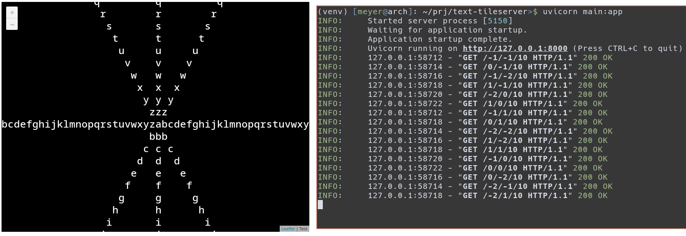

# Text tile server
A (poorly) implemented tile server that serves text instead of satellite/gis images.

## Why?
Why not? I was just toying around with some things and decided to try it.

## Run

Server:
```bash
$ uvicorn main:app
INFO:     Started server process [5652]
INFO:     Waiting for application startup.
INFO:     Application startup complete.
INFO:     Uvicorn running on http://127.0.0.1:8000 (Press CTRL+C to quit)
```

Open `index.html` in your browser.

## How
Mapping frameworks, such as [leaflet](https://leafletjs.com/) require that you pass some sort of URL where it gets images from. This URLs usually have a format like so:

```
example.org/{x}/{y}/{z}
```

These coordinates, `x`, `y` and `z` usually represent where Leaflet is positioned. They are used to fetch the correct images to display based on the position. Note that they do not follow, necessarily, EPSG coordinates. If you look at the logs of our server, only coordinates in integer are fetched. Example: `/-1/0/10`.

We use these coordinates to build a very simple image based on our (fake) database. The font and the size used were selected based on trial and error of the ones that fitted the 256x256 images returned by the server.

## Image
Here is an image of the server working with the `index.html` on its side.


